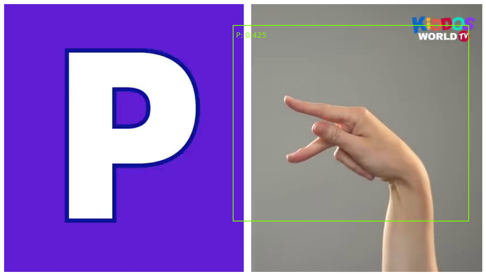
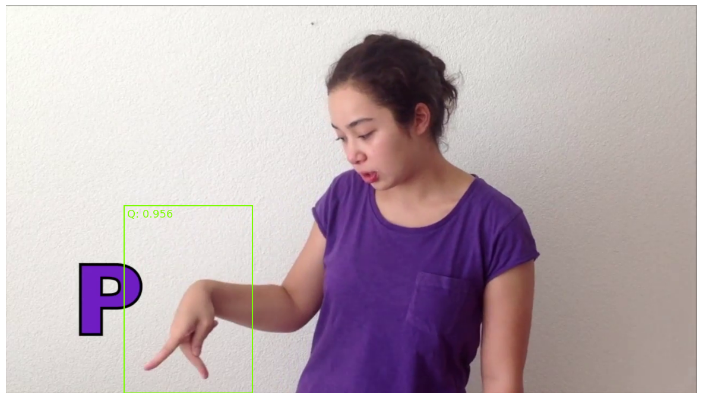
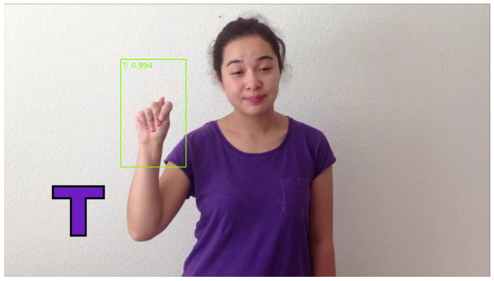
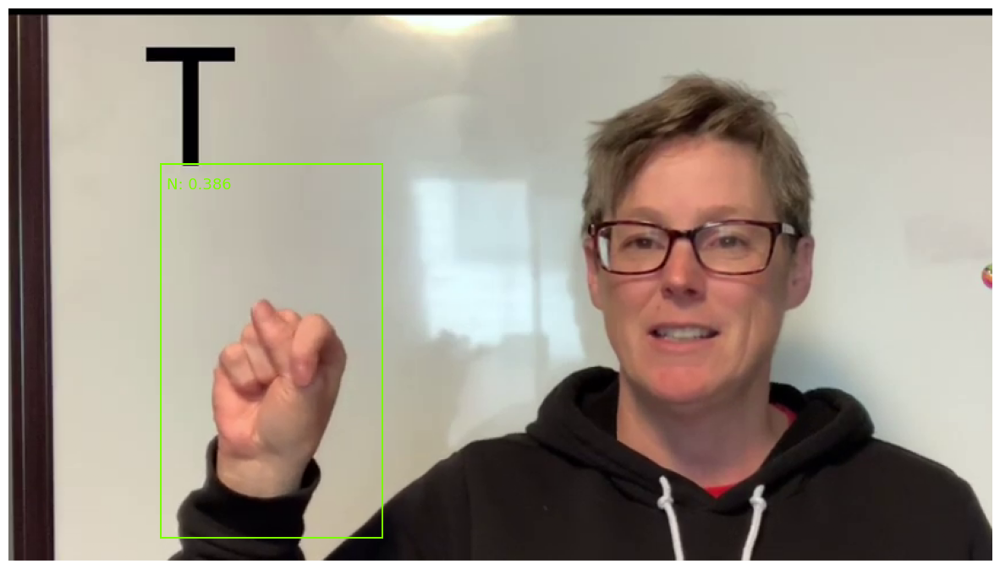
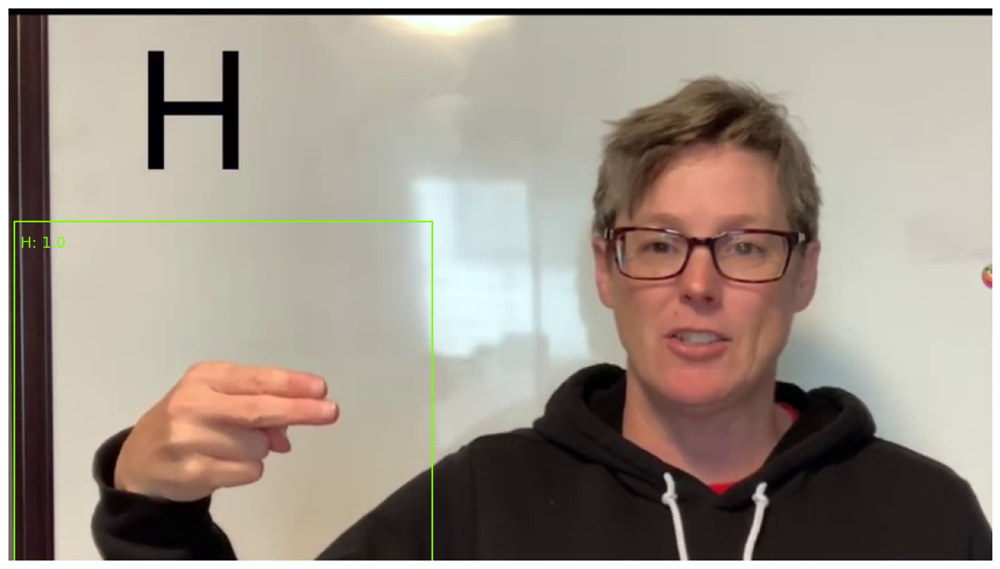

# ASL Recognition using YOLOv5 and EfficientNet

This project focuses on data processing, then training on YOLOv5 and EfficientNet models for 2 stages object detection and classification, respectively. \
The training process is done using @kaylode's <a href="https://github.com/kaylode/theseus">Theseus template</a>. \
I have added the above template to predict the combined results based on 2 models in 2 stages (with k-fold Cross-validation support), see my modifications <a href="https://github.com/cngthnh/custom-template/tree/inference">here</a>. \
To know more about this project, see <a href="https://github.com/cngthnh/ASL-Recognition/blob/main/Paper.pdf">Paper.pdf</a>. \
Demo:\

